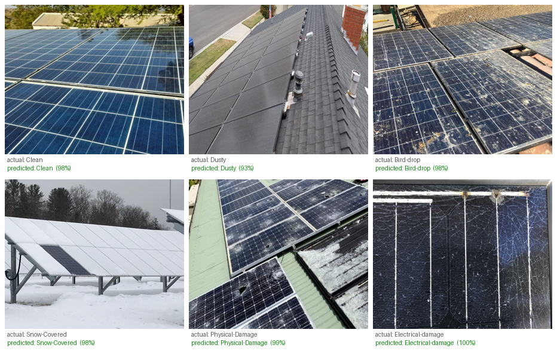
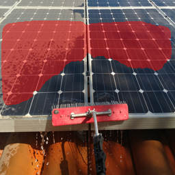

# Solar Panel Soiling & Fault Analysis

[](https://github.com/SenyuZ/solar-panel-soiling/actions/workflows/ci.yml)

Computer-vision toolkit for assessing the condition of photovoltaic (solar) panels from
ordinary photos: whether a panel is clean or dirty, what kind of soiling or fault is
present, how much of the surface is affected, and where.

**[▶ Try it live (no install)](https://huggingface.co/spaces/SenyuZ/solar-panel-soiling)**  ·  binary + 6-class  ·  classical baseline  ·  severity  ·  Grad-CAM

| | |
|---|---|
| Task | clean/dirty + 6-class soiling/fault classification, severity, and dust segmentation |
| Data | curated multi-source (Kaggle + SolNet); external OOD test (Roboflow); DeepSolarEye (severity) |
| Models | ResNet-50 classifier · classical SVM/RF baseline · ResNet-34 U-Net segmenter (exploratory) |
| Result | 0.821 F1 in-domain, 0.952 F1 on a leak-free external OOD set, +11 F1 over the best classical baseline |

The binary classifier trains on 2,320 curated images (1,305 clean / 1,015 dirty) pooled from
three public sources and de-duplicated, with 186 watermarked images removed because they
were inflating the benchmark. Generalisation is measured on a separate, leak-free external
set (2,485 panel-filling photos, zero overlap with training). Full sources, counts and
licences are in [`DATASET.md`](DATASET.md).

It started as a University of Technology Sydney (UTS) Image Processing & Pattern
Recognition group project (binary clean/dirty classification) and has since been rebuilt
into a reproducible package and extended along several axes: multi-class classification, a
classical image-processing baseline, soiling-severity estimation and segmentation, and
Grad-CAM explainability, plus an interactive demo.

> **Status.** A clean, installable Python package with 22 passing tests. The binary and
> multi-class (6-class + 3-way condition) classifiers, the classical baseline, Grad-CAM,
> severity Track A and the demo all run with real results on Apple-Silicon MPS (see
> [`reports/results.md`](reports/results.md)). The DeepSolarEye severity regressor
> (Track B) is trained on the real 45k-image dataset and predicts a panel's power loss to
> MAE ≈ 0.075 (about 7.5 percentage points). See [`DATASET.md`](DATASET.md) for data
> sources.

**Try it live (no install):** https://huggingface.co/spaces/SenyuZ/solar-panel-soiling.
Drop in a panel photo and get the condition, Grad-CAM, the classical soiling overlay next
to the U-Net dust segmentation (side by side, to compare them), and a measured power-loss.
It is hosted on a free CPU Space, so the first load may take a few seconds to wake. To run
the same demo locally: `python app/app.py`.

---

## Highlights

| Capability | What it does | Module |
|---|---|---|
| Binary classification | ResNet-50 transfer learning, two-stage fine-tuning (the original task) | `solarsoil.train` / `models.cnn` |
| Multi-class (hierarchical) | clean / soiled {dust, bird-drop, snow} / damaged {physical, electrical} | `solarsoil.taxonomy` + configs |
| Classical IP baseline | HSV colour + GLCM/LBP texture + edge features → SVM/RF, benchmarked against the CNN | `features.classical` / `models.classical` |
| Severity / coverage | classical soiling index + coverage map (Track A); DeepSolarEye power-loss CNN regression (Track B) | `severity` · `models.regression` |
| Soiling segmentation (exploratory) | ResNet-34 U-Net (pretrained encoder); the only available dust masks were third-party and too inconsistent to validate — kept as future work | `models.segmentation` |
| Explainability | from-scratch Grad-CAM heatmaps (also the weak-localisation signal for severity) | `explain.gradcam` |
| Interactive demo | drop a photo → prediction + Grad-CAM + classical soiling overlay vs U-Net segmentation (side by side) + measured power-loss (Track B) | `app/app.py` |

Engineering: config-driven CLIs, fixed seeds, a non-destructive stratified manifest split,
CUDA/MPS/CPU support, best/last checkpoints, metric history (JSON+CSV), and unit tests.

## Examples

Binary test set (modular ResNet-50, curated multi-source set, watermarks removed): 85.1%
accuracy, 0.821 F1, 0.696 MCC, about 11 F1 points above the best classical baseline (SVM,
0.712 F1). On a fully external, leak-free out-of-distribution set (2,485 panel-filling
photos from a different source and country): 0.952 F1, so it generalises far better than
the in-domain number alone suggests. Multi-class (6 classes): macro-F1 0.857, with the rare
fault classes held up by class weighting; 3-way clean/soiled/damaged: macro-F1 0.883. Full
tables and the deep-vs-classical discussion are in [`reports/results.md`](reports/results.md).

The 6-class model classifies the fault type directly — one held-out example per class, with
the model's predicted label and confidence:



(Macro-F1 0.857 across the six classes; full numbers in [`reports/results.md`](reports/results.md).)

| Grad-CAM, *where the model looks* (multi-class, physical damage) | Soiling coverage, *how much surface is dirty* (classical, Track A) |
|---|---|
|  |  |

> ⚠️ These are two different things. Grad-CAM is a coarse attention heatmap ("where did the
> classifier look?"), while the soiling overlay is the coverage estimate ("how much of the
> surface is dirty?"). A Grad-CAM blob is not a dirt map, and on the binary model it
> sometimes lands on the background (see Limitations below).

I also built a ResNet-34 U-Net (ImageNet-pretrained encoder) to segment dust directly. I keep
it as exploratory / future work, not a headline result: the only dust-mask labels I could find
were a third-party set, and on inspection they are inconsistent — many mark background, sky, or
even watermark text rather than soiling, so there is no trustworthy ground truth to train or
score against. The overlay below is a qualitative illustration only; see
[Limitations](#limitations--failure-analysis).



## Repository layout

```
solar-panel-soiling/
├── src/solarsoil/         # the package
│   ├── data/              # dedup, manifest, datasets, downloads
│   ├── features/          # classical hand-crafted features
│   ├── models/            # CNN backbones, classical SVM/RF, U-Net segmenter
│   ├── explain/           # Grad-CAM
│   ├── severity.py        # soiling coverage / severity (Tracks A & B)
│   ├── taxonomy.py        # binary / condition / multiclass label spaces
│   ├── train.py · evaluate.py · predict.py · engine.py · metrics.py · utils.py
├── configs/               # binary / condition / multiclass / classical / severity
├── app/app.py             # Gradio demo
├── manifests/             # committed split metadata (no images)
├── reports/               # results.md + figures
├── tests/                 # pytest suite
├── DATASET.md             # data provenance, licences, citations
└── pyproject.toml · requirements.txt · LICENSE
```

## Installation

```bash
python -m venv .venv && source .venv/bin/activate
pip install -r requirements.txt
pip install -e .                 # installs the `solarsoil` package + CLIs
```

## Quickstart (binary, curated multi-source set in `Data/curated/`)

```bash
# 1. Build a stratified train/val/test manifest from Data/curated/{Clean,Dusty}
#    (the committed manifests/binary_manifest.csv already pins this split)
python -m solarsoil.data.manifest --data-root Data/curated --out manifests/binary_manifest.csv --label-space binary

# 2. Train the ResNet-50 baseline (auto-uses CUDA > MPS > CPU)
python -m solarsoil.train --config configs/binary.yaml

# 3. Evaluate on the test split (metrics + confusion matrices)
python -m solarsoil.evaluate --model artifacts/binary/model.pth --manifest manifests/binary_manifest.csv --split test

# 4. Predict on a single image, with a Grad-CAM overlay
python -m solarsoil.predict --model artifacts/binary/model.pth --image Data/curated/Dusty/detect_solar_dust_dirty_Imgdirty_1002_1.jpg --gradcam

# 4b. Add a measured % power-loss estimate (Track B / DeepSolarEye regressor).
#     NB: accurate only on panel-filling photos; on wide background-heavy shots
#     it is cross-domain and indicative at best — see Limitations.
python -m solarsoil.predict --model artifacts/binary/model.pth --image Data/curated/Dusty/detect_solar_dust_dirty_Imgdirty_1002_1.jpg --power-loss

# 5. Classical baseline (image processing + SVM) for comparison
python -m solarsoil.models.classical --config configs/classical.yaml --model-type svm

# 6. Classical soiling/severity estimate (no training needed)
python -m solarsoil.severity --image Data/curated/Dusty --limit 20 --out-dir reports/figures/coverage

# 7. Interactive demo
python app/app.py
```

> Tip: append `--epochs 1 --max-steps 5 --num-workers 0` to `train` for a fast smoke run.

## Extensions that need a dataset download

```bash
# Multi-class (6 classes) / condition (clean·soiled·damaged)
python -m solarsoil.data.download --source faulty
python -m solarsoil.data.manifest --data-root Data/raw/faulty/Faulty_solar_panel --out manifests/multiclass_manifest.csv --label-space multiclass
python -m solarsoil.train --config configs/multiclass.yaml      # or configs/condition.yaml

# Severity Track B (DeepSolarEye, measured % power loss)
python -m solarsoil.data.download --source deepsolareye
```

See [`DATASET.md`](DATASET.md) for sources, licences and citations, and
[`reports/results.md`](reports/results.md) for the results tables.

## Methodology in brief

- Transfer learning. ImageNet-pretrained backbone; stage 1 trains only a new head (frozen
  backbone), stage 2 fine-tunes everything at a lower LR. Class imbalance is handled with
  weighted cross-entropy.
- Taxonomy. Soiling (removable, temporary power loss) and damage (permanent, needs repair)
  are physically different, so the label space is a 2-level hierarchy (condition → type)
  rather than one flat set.
- Classical baseline. Interpretable colour/texture/edge descriptors + SVM/RF, to quantify
  how far simple image processing gets versus deep features.
- Severity. Track A is an unsupervised, saturation-based soiling index + coverage map
  (transparent but approximate); Track B learns measured power loss from DeepSolarEye for a
  calibrated estimate.
- Explainability. Grad-CAM over the last conv block shows where the model sees
  soiling/faults.

## Limitations & failure analysis

- The binary model still partly exploits background context (shortcut learning). Grad-CAM
  shows that on whole-scene, wide-angle Dust-Detection photos the clean/dirty classifier
  often attends to the surroundings (buildings, sky, people) instead of the panel. An OCR
  audit (`scripts/triage_suspects.py`) also found 186 images (about 7%) carrying tiled
  stock-photo watermarks (Shutterstock/Dreamstime), another spurious cue, which were removed
  along with near-duplicates (see DATASET.md). Tellingly, removing the watermarks lowered
  the in-domain score (0.880 → 0.821 F1): they had been making the benchmark artificially
  easy. The wide-scene background attention persists in Grad-CAM even after cleaning.

  But does any of this actually hurt real generalisation? No, and I verified that on a clean
  external OOD set. Evaluated on 2,485 panel-filling photos from a different source, country
  and camera ([Roboflow "solar panel dirt det"](https://universe.roboflow.com/alex-jcvyb/solar-panel-dirt-det),
  CC BY 4.0; zero perceptual-hash overlap with training, see `DATASET.md`), the model scores
  0.952 F1, 0.912 macro-F1, MCC 0.835, which is higher than on its own (now watermark-free,
  harder) in-domain test, and barely changed by the cleanup. These images are
  panel-filling with almost no background, so the shortcut cannot help: the strong score
  shows the model has learned real dust/panel features, and the background reliance is a
  wide-scene artefact the model does not actually rely on. (This is a true
  out-of-distribution test, replacing an earlier within-Kaggle pythonafroz cross-check;
  pythonafroz is now part of training.) The multi-class model (tight panel crops) doesn't
  show the shortcut at all.

  | ✅ Works on tight crops | ❌ Fails on wide scenes |
  |---|---|
  |  |  |
  | Both hot spots land on the actual bird droppings (multi-class, tight panel crop). | A "clean" prediction driven by the background cityscape/crane, not the panels at the bottom. |

  Why the wide-scene cases fail (one root cause). Almost every bad figure in this project,
  the heatmap on a person standing on the array, the coverage overlay smeared across sky and
  buildings, the empty segmentation mask, comes from the uncurated wide-angle Dust-Detection
  photos, where the panel occupies a small fraction of the frame. Both the attention map and
  the unsupervised desaturation then latch onto whatever dominates the image, which is
  background. The tight-crop multi-class images (above) don't show this at all. A related,
  milder point: on a clean panel there is no dirt to localize, so a "find the dirt"
  heatmap or coverage map is ill-posed and will point somewhere arbitrary.

  Mitigation (future work), and why standardised data matters. The fix is to detect and crop
  to the panel region before classifying, so only the panel and its dirt are in frame. That
  removes the background the model can cheat on, makes the attention maps and coverage
  overlays meaningful, and would need a panel detector or segmentation head (real work, hence
  future). More broadly, the failures here are a data-quality story as much as a modelling
  one: the tight-crop pythonafroz and multi-class sets, where every image is standardised to
  a single centred panel, give clean attention and reliable coverage, while the uncurated
  wide-angle photos do not, even after curation. Consistent framing, scale, and subject
  isolation at capture time are worth more than extra model capacity; a detector/crop step is
  really a way to impose that standardisation after the fact.

- Grad-CAM is a diagnostic, not a dirt localizer. It comes from a roughly 7×7 conv grid, so
  it is always a blurry blob: it answers where the model looked, not which pixels are dirty.
  That makes it well-suited to discrete, localized faults (a crack, a clump of bird
  droppings) but a poor fit for diffuse soiling (a dust film or snow over the whole panel),
  where there is no single spot to point at and the blob just lands on the highest-contrast
  patch. Its real value in this project is model introspection: it is how the background
  shortcut above was discovered. Spatial extent ("how much / where is the dirt") is answered
  by the segmentation model and the classical soiling overlay (Track A), which are the right
  tools for the job. Sharper CAM variants (Grad-CAM++, Score-CAM, LayerCAM) would give less
  blobby, multi-region maps but remain bounded by the conv resolution.

- Dust segmentation is exploratory, held back by label quality. I built a ResNet-34 U-Net to
  segment dust directly, but the only labels available were a third-party set (the Kaggle
  dust-segmentation dataset) that, on inspection, are inconsistent — a large share mark
  background, sky, people, or watermark text rather than soiling. The U-Net was trained on
  those masks, so it inherits their errors, and any score against them (it reaches test Dice
  0.47 / IoU 0.38 on the same labels) is not meaningful. Doing this properly means drawing our
  own pixel-accurate masks in the `image → binary mask` format and retraining — significant
  dedicated labelling work, which is why it stays future work. The classical Track-A soiling
  overlay (unsupervised, needs no labels) is the usable estimate in the meantime.

- The soiling tools are dust-specific — even in the demo. The dust segmentation (U-Net) and
  the power-loss regressor (Track B / DeepSolarEye) were both trained only on dust/soiling,
  so they have no notion of cracks, burns, bird-drops or snow. The demo runs them on whatever
  you upload, including the damage classes, but on a non-soiling fault they are out-of-domain:
  the dust overlay and the power-loss number there are not meaningful and should be ignored.
  They only carry information on dusty/soiled panels.

- Track A's soiling index is unsupervised and approximate (relative desaturation, not
  calibrated coverage); for trustworthy numbers use the Track B power-loss model.

- Track B is a quick run (ResNet-18, 12k-image subset, 8 epochs); training on the full 45k
  set for longer would lower the MAE further.

- Track B is calibrated to DeepSolarEye's domain, not arbitrary photos. The MAE ≈ 0.075
  holds on DeepSolarEye's own test split, close-framed panels that fill the image. Pointing
  the regressor at the wide-angle Dust-Detection photos (or any shot where the panel is a
  small subject against a large background) is a cross-domain use: the number it returns is
  indicative at best and will not be accurate, the same background-dominance problem
  described above. Treat the on-image power-loss from `--power-loss` and the demo as a real
  number only on panel-filling images; for wide scenes, crop to the panel first.

## Tests

```bash
pytest -q
```

## Acknowledgements & attribution

This work originated as Team 7's project for UTS *Image Processing and Pattern Recognition*
(Assignment 2, 2025). Team members: Jiaao Su, Timothy Chan, Md Fardin Hossain, Zhengda Peng,
Senyu Zhu, Anik Chandra Sarkar.

This published repository builds on and extends my contributions to that project: the
dataset retrieval / de-duplication / curation pipeline and the ResNet-50 transfer-learning
classifier. Other components of the original group submission (additional CNN/VGG16/InceptionV3
benchmarking and U-Net segmentation experiments) were led by other team members and are not
included here. The multi-class, classical-baseline, severity, Grad-CAM and demo work is new.

Notably, the original report's stated future work, *"localize soiling, quantify the
dirty-area ratio, and trigger cleaning decisions based on thresholds rather than coarse
binary labels"*, directly motivates the severity/coverage extension.

- Data sources, licences and citations: [`DATASET.md`](DATASET.md). Images are not
  redistributed here; download scripts fetch them locally.
- DeepSolarEye: Mehta et al., *WACV 2018*; SolNet: Onim et al., *Energies* 2023 (see
  `DATASET.md`).

## License

Code: [MIT](LICENSE). Datasets retain their own licences (see `DATASET.md`).
