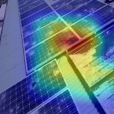
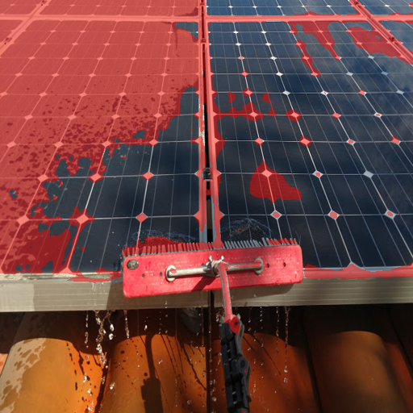
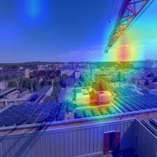

# Solar Panel Soiling & Fault Analysis

Computer-vision toolkit for assessing the condition of photovoltaic (solar)
panels from ordinary photos: is a panel **clean or dirty**, *what kind* of soiling
or fault is present, *how much* of the surface is affected, and *where*.

It started as a University of Technology Sydney (UTS) **Image Processing & Pattern
Recognition** group project (binary clean/dirty classification) and has been
rebuilt into a reproducible package and extended along four axes: multi-class
classification, a classical image-processing baseline, soiling-severity
estimation, and Grad-CAM explainability — plus an interactive demo.

> **Status.** A clean, installable Python package with 18 passing tests. The binary
> and multi-class (6-class + 3-way condition) classifiers, the classical baseline,
> Grad-CAM, severity Track A and the demo all run with **real results** on
> Apple-Silicon MPS (see [`reports/results.md`](reports/results.md)). The DeepSolarEye
> severity regressor (Track B) is trained on the real 45k-image dataset — it predicts
> a panel's power loss to **MAE ≈ 0.075** (~7.5 percentage points). See
> [`DATASET.md`](DATASET.md) for data sources.

---

## Highlights

| Capability | What it does | Module |
|---|---|---|
| **Binary classification** | ResNet-50 transfer learning, two-stage fine-tuning (the original task) | `solarsoil.train` / `models.cnn` |
| **Multi-class (hierarchical)** | clean / soiled {dust, bird-drop, snow} / damaged {physical, electrical} | `solarsoil.taxonomy` + configs |
| **Classical IP baseline** | HSV colour + GLCM/LBP texture + edge features → SVM/RF, benchmarked vs the CNN | `features.classical` / `models.classical` |
| **Severity / coverage** | classical soiling index + coverage map (Track A); DeepSolarEye power-loss CNN regression (Track B) | `severity` · `models.regression` |
| **Explainability** | from-scratch Grad-CAM heatmaps (also the weak-localisation signal for severity) | `explain.gradcam` |
| **Interactive demo** | drop a photo → prediction + Grad-CAM + soiling overlay | `app/app.py` |

Engineering: config-driven CLIs, fixed seeds, a non-destructive stratified
manifest split, CUDA/MPS/CPU support, best/last checkpoints, metric history
(JSON+CSV), and unit tests.

## Examples

Binary test set (modular ResNet-50): **84.2% accuracy, 0.811 F1, 0.675 MCC** —
about 10 F1 points above the best classical baseline (SVM, 0.712 F1).
Multi-class (6 classes): **macro-F1 0.857**, with the rare fault classes held up by
class weighting; 3-way clean/soiled/damaged: **macro-F1 0.883**. Full tables and
the deep-vs-classical discussion are in [`reports/results.md`](reports/results.md).

| Grad-CAM — *where the model looks* (multi-class, physical damage) | Soiling coverage — *how much surface is dirty* (classical, Track A) |
|---|---|
|  |  |

> ⚠️ These are **two different things**: Grad-CAM is a coarse *attention* heatmap
> ("where did the classifier look?"), while the soiling overlay is the *coverage*
> estimate ("how much of the surface is dirty?"). A Grad-CAM blob is **not** a dirt
> map — and on the binary model it sometimes lands on the background (see
> **Limitations** below).

## Repository layout

```
solar-panel-soiling/
├── src/solarsoil/         # the package
│   ├── data/              # dedup, manifest, datasets, downloads
│   ├── features/          # classical hand-crafted features
│   ├── models/            # CNN backbones + classical SVM/RF
│   ├── explain/           # Grad-CAM
│   ├── severity.py        # soiling coverage / severity (Tracks A & B)
│   ├── taxonomy.py        # binary / condition / multiclass label spaces
│   ├── train.py · evaluate.py · predict.py · engine.py · metrics.py · utils.py
├── configs/               # binary / condition / multiclass / classical / severity
├── app/app.py             # Gradio demo
├── manifests/             # committed split metadata (no images)
├── reports/               # results.md + figures
├── tests/                 # pytest suite
├── DATASET.md             # data provenance, licences, citations
└── pyproject.toml · requirements.txt · LICENSE
```

## Installation

```bash
python -m venv .venv && source .venv/bin/activate
pip install -r requirements.txt
pip install -e .                 # installs the `solarsoil` package + CLIs
```

## Quickstart (binary, uses the included `Data/`)

```bash
# 1. Build a stratified train/val/test manifest from Data/{Clean,Dusty}
python -m solarsoil.data.manifest --data-root Data --out manifests/binary_manifest.csv --label-space binary

# 2. Train the ResNet-50 baseline (auto-uses CUDA > MPS > CPU)
python -m solarsoil.train --config configs/binary.yaml

# 3. Evaluate on the test split (metrics + confusion matrices)
python -m solarsoil.evaluate --model artifacts/binary/model.pth --manifest manifests/binary_manifest.csv --split test

# 4. Predict on a single image, with a Grad-CAM overlay
python -m solarsoil.predict --model artifacts/binary/model.pth --image Data/Dusty/Imgdirty_0_1.jpg --gradcam

# 5. Classical baseline (image processing + SVM) for comparison
python -m solarsoil.models.classical --config configs/classical.yaml --model-type svm

# 6. Classical soiling/severity estimate (no training needed)
python -m solarsoil.severity --image Data/Dusty --limit 20 --out-dir reports/figures/coverage

# 7. Interactive demo
python app/app.py
```

> Tip: append `--epochs 1 --max-steps 5 --num-workers 0` to `train` for a fast
> smoke run.

## Extensions that need a dataset download

```bash
# Multi-class (6 classes) / condition (clean·soiled·damaged)
python -m solarsoil.data.download --source faulty
python -m solarsoil.data.manifest --data-root Data/raw/faulty/Faulty_solar_panel --out manifests/multiclass_manifest.csv --label-space multiclass
python -m solarsoil.train --config configs/multiclass.yaml      # or configs/condition.yaml

# Severity Track B (DeepSolarEye, measured % power loss)
python -m solarsoil.data.download --source deepsolareye
```

See [`DATASET.md`](DATASET.md) for sources, licences and citations, and
[`reports/results.md`](reports/results.md) for the results tables.

## Methodology in brief

- **Transfer learning.** ImageNet-pretrained backbone; stage 1 trains only a new
  head (frozen backbone), stage 2 fine-tunes everything at a lower LR. Class
  imbalance handled with weighted cross-entropy.
- **Taxonomy.** Soiling (removable, temporary power loss) and damage (permanent,
  needs repair) are physically different, so the label space is a 2-level
  hierarchy (condition → type) rather than one flat set.
- **Classical baseline.** Interpretable colour/texture/edge descriptors + SVM/RF,
  to quantify how far simple image processing gets versus deep features.
- **Severity.** Track A is an unsupervised, saturation-based soiling index +
  coverage map (transparent but approximate); Track B learns measured power loss
  from DeepSolarEye for a calibrated estimate.
- **Explainability.** Grad-CAM over the last conv block shows *where* the model
  sees soiling/faults.

## Limitations & honest caveats

- **The binary model partly exploits background context (shortcut learning).**
  Grad-CAM revealed that on the uncurated, whole-scene Dust-Detection photos, the
  clean/dirty classifier sometimes attends to the *surroundings* (buildings, sky,
  people) rather than the panel — because the two classes differ in their
  backgrounds, the model can partly "cheat." It still scores ~0.81 F1, but it would
  not generalise to, say, a clean panel in a dusty setting. The multi-class model
  (tight panel crops) does **not** show this — its Grad-CAM sits on the actual fault.

  

  *Failure case: a "clean" prediction driven by the background cityscape/crane, not
  the panels at the bottom.* **Mitigation (future work):** detect/crop to the panel
  region before classifying, so only the panel and its dirt are visible.

- **Grad-CAM is coarse and is not a coverage map.** It comes from a ~7×7 conv grid,
  so it's always a blurry blob: it answers *where the model looked*, not *which
  pixels are dirty*. Surface-area "how dirty" is a **separate** output (the classical
  soiling overlay, Track A).

- **Track A's soiling index is unsupervised and approximate** (relative desaturation,
  not calibrated coverage); for trustworthy numbers use the Track B power-loss model.

- **Track B is a quick run** (ResNet-18, 12k-image subset, 8 epochs); training on the
  full 45k set for longer would lower the MAE further.

## Tests

```bash
pytest -q
```

## Acknowledgements & attribution

This work originated as **Team 7's** project for UTS *Image Processing and Pattern
Recognition* (Assignment 2, 2025). Team members: Jiaao Su, Timothy Chan, Md Fardin
Hossain, Zhengda Peng, Senyu Zhu, Anik Chandra Sarkar.

This published repository builds on and extends **Senyu Zhu's** contributions to
that project — the dataset retrieval / de-duplication / curation pipeline and the
ResNet-50 transfer-learning classifier. Other components of the original group
submission (additional CNN/VGG16/InceptionV3 benchmarking and U-Net segmentation
experiments) were led by other team members and are **not** included here. The
multi-class, classical-baseline, severity, Grad-CAM and demo work is new.

Notably, the original report's stated future work — *"localize soiling, quantify
the dirty-area ratio, and trigger cleaning decisions based on thresholds rather
than coarse binary labels"* — directly motivates the severity/coverage extension.

- Data sources, licences and citations: [`DATASET.md`](DATASET.md). Images are
  **not** redistributed here; download scripts fetch them locally.
- DeepSolarEye: Mehta et al., *WACV 2018*; SolNet: Onim et al., *Energies* 2023
  (see `DATASET.md`).

## License

Code: [MIT](LICENSE). Datasets retain their own licences (see `DATASET.md`).
