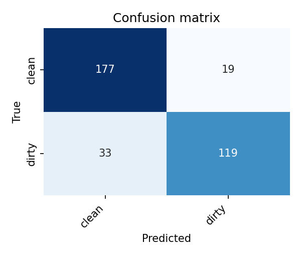
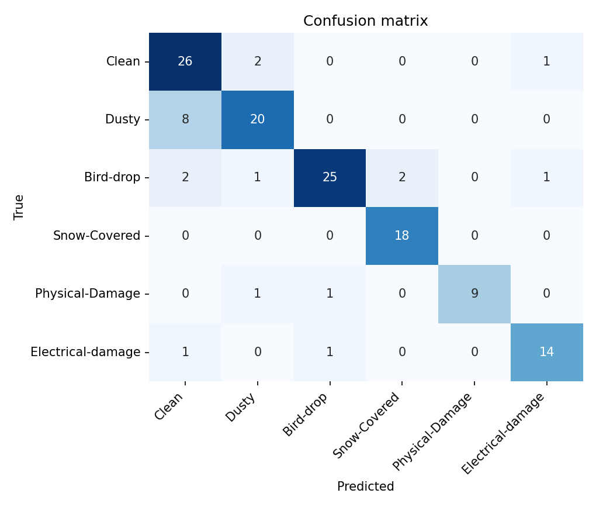

# Results

Reproduce everything with the commands in each section. The modular binary numbers
below are from an actual run on this machine (Apple-Silicon MPS, fp32) over the
**Dust Detection** set in `Data/`. The original Colab figures (A100) are shown for
context but were measured on the project's **merged 3-dataset** curation (≈3,539
images, different test split), so the two CNN rows are *not* directly comparable —
see the note under the table. Extension rows need their datasets — see `DATASET.md`.

## Binary: clean vs dirty (test set, n = 385)

| Model | Accuracy | Precision | Recall | F1 | MCC |
|---|---|---|---|---|---|
| ResNet-50 (original Colab, *merged 3-dataset* test, A100) | 0.901 | 0.854 | 0.908 | 0.881 | 0.797 |
| **ResNet-50 (modular re-run, *Dust Detection* set, MPS)** | **0.842** | 0.809 | 0.814 | **0.811** | 0.675 |
| Classical SVM (HSV + GLCM/LBP + edges) | 0.758 | 0.710 | 0.714 | 0.712 | 0.504 |
| Classical Random Forest | 0.738 | 0.708 | 0.634 | 0.669 | 0.455 |

Per-class (modular ResNet-50): clean P/R/F1 = 0.865 / 0.862 / 0.864 · dirty =
0.809 / 0.814 / 0.811. Training early-stopped at epoch 14; best validation F1
0.865 at epoch 9.

**Reading the table.** The two CNN rows are on *different test sets* — the original
Colab run used the merged 3-dataset curation (which included the high-quality
SolNet images), while the modular re-run uses the single Dust Detection set in
`Data/` — so the 0.881 → 0.811 F1 difference is mostly a different/harder test set
(plus fp32 on MPS vs AMP), not a regression. The directly comparable result is the
**deep-vs-classical gap** on the *same* `Data/` split: ResNet-50's 0.811 F1 vs the
best classical 0.712 (SVM) — learned features add ~10 F1 points over hand-crafted
colour/texture/edge descriptors. On this data the main *classical* separable cue
is saturation (dust greys panels out); see `solarsoil/severity.py`.



```bash
python -m solarsoil.train             --config configs/binary.yaml
python -m solarsoil.evaluate          --model artifacts/binary/model.pth --manifest manifests/binary_manifest.csv --split test
python -m solarsoil.models.classical  --config configs/classical.yaml --model-type svm
python -m solarsoil.models.classical  --config configs/classical.yaml --model-type rf
```

## Multi-class & condition (pythonafroz 6-class set, n_test = 133)

| Task | Backbone | Accuracy | Macro-F1 | MCC |
|---|---|---|---|---|
| **6-class** (Clean/Dusty/Bird-drop/Snow/Physical/Electrical) | ResNet-50 | 0.842 | **0.857** | 0.809 |
| **3-way condition** (clean / soiled / damaged) | ResNet-50 | 0.895 | **0.883** | 0.818 |

Per-class F1 (6-class): Snow-Covered 0.95, Physical-Damage 0.90, Electrical-damage
0.88, Bird-drop 0.86, Clean 0.79, Dusty 0.77 — despite heavy imbalance (only 48
Physical-Damage training images), weighted cross-entropy keeps the rare *fault*
classes strong (macro-F1 0.857). The 3-way condition model (the soiling-vs-fault
framing) reaches macro-F1 0.883. Best val-F1: multiclass 0.908 @ epoch 23,
condition 0.907 @ epoch 9.



```bash
python -m solarsoil.data.download --source faulty
python -m solarsoil.data.manifest --data-root Data/raw/faulty/Faulty_solar_panel --out manifests/multiclass_manifest.csv --label-space multiclass
python -m solarsoil.train     --config configs/multiclass.yaml
python -m solarsoil.evaluate   --model artifacts/multiclass/model.pth --manifest manifests/multiclass_manifest.csv --split test
```

## Severity / coverage (Phase 4)

* **Track A (classical, runs now):** the saturation-based soiling index orders
  dusty above clean on average (sampled panels: clean ≈ 0.10–0.32, dusty ≈
  0.21–0.47). Absolute coverage is approximate — clean and dusty overlap in
  low-level cues, which is exactly why the CNN is worthwhile. Track A is best
  used as a relative index + localisation aid (red overlay below).
* **Track B (DeepSolarEye — real run):** a 1-output CNN regressor (MSE) trained on
  the measured % power loss of **45,721** real panel images. A quick run (ResNet-18,
  12k stratified subset, 8 epochs, MPS) predicts power loss with **MAE ≈ 0.075** —
  on average within **~7.5 percentage points** of the true value (RMSE 0.110; best
  val MSE 0.009). More epochs / the full 45k set would tighten it further.

```bash
python -m solarsoil.data.download --source deepsolareye      # ~864 MB, auto-extracts
python -m solarsoil.models.regression manifest \
    --data-root Data/raw/deepsolareye/extracted/Solar_Panel_Soiling_Image_dataset/PanelImages \
    --out manifests/deepsolareye_manifest.csv
python -m solarsoil.models.regression train --manifest manifests/deepsolareye_manifest.csv \
    --backbone resnet18 --limit 12000 --epochs 8
```


```bash
python -m solarsoil.severity --image Data/Dusty --limit 25 --out-dir reports/figures/coverage
```
